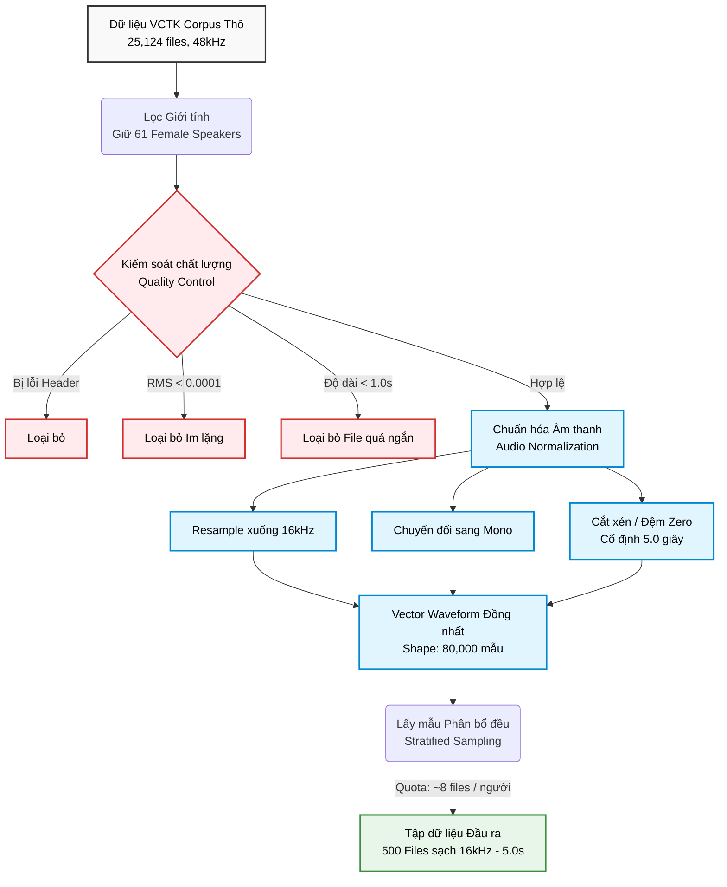
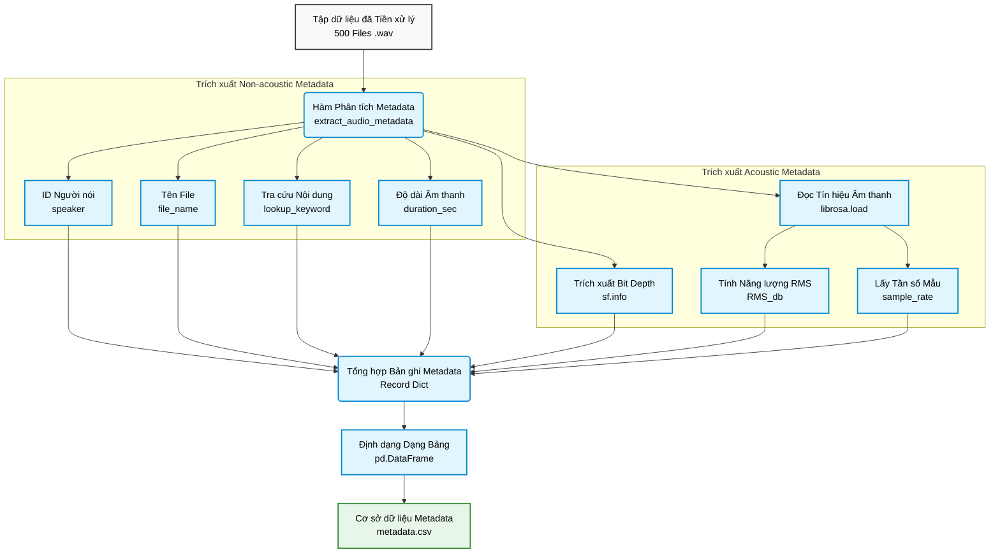
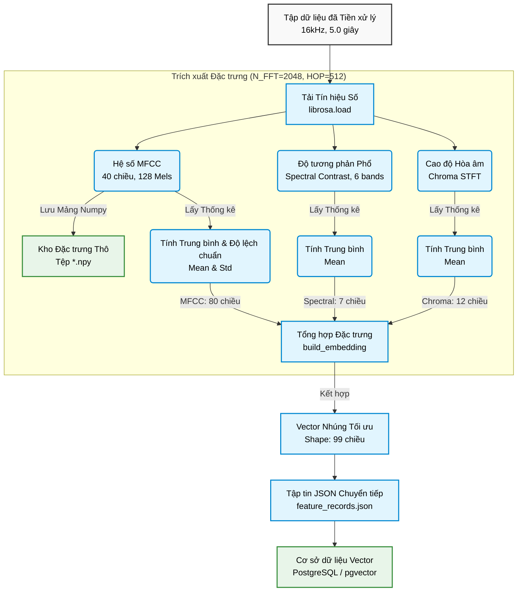
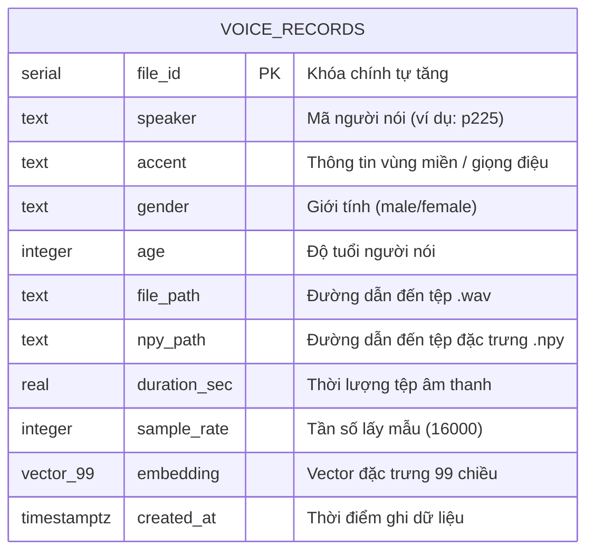

# CHƯƠNG 2: TIỀN XỬ LÝ & LƯU TRỮ DỮ LIỆU

Dưới đây là cấu trúc chi tiết cho chương Tiền xử lý và Lưu trữ dữ liệu. Mỗi giai đoạn đều đi kèm với một sơ đồ luồng dữ liệu (Pipeline) phản ánh trực tiếp logic triển khai trong mã nguồn dự án.

---

## 2.1. Tiền xử lý dữ liệu (Data Preprocessing)

Giai đoạn tiền xử lý đóng vai trò quyết định đến chất lượng của các đặc trưng trích xuất sau này. Mục tiêu chính là chuyển đổi dữ liệu âm thanh thô (raw audio) từ VCTK Corpus thành định dạng chuẩn hóa, loại bỏ nhiễu và đảm bảo tính nhất quán về mặt toán học cho các mô hình học máy.

### 2.1.1. Làm sạch dữ liệu (Data Cleaning)
**Lý thuyết:**
Dữ liệu âm thanh thô thường chứa nhiều thành phần không hữu ích như khoảng lặng kéo dài (silence), file lỗi (corrupt header), hoặc các đoạn thu âm quá ngắn không đủ thông tin ngữ âm. Việc giữ lại các tệp này sẽ gây "nhiễu" cho không gian đặc trưng, làm giảm độ chính xác của hệ thống nhận diện.

**Quá trình thực hiện:**
Quy trình được triển khai theo các giai đoạn logic nhằm đảm bảo tính toàn vẹn và sạch sẽ của dữ liệu:
1. **Thiết lập cấu hình tập trung (Bước 0):** Mọi tham số kỹ thuật và đường dẫn thư mục được quản lý tập trung. Hệ thống sử dụng cơ chế xác định đường dẫn động để mã nguồn có thể tự thích nghi với môi trường lưu trữ trên các hệ điều hành khác nhau, loại bỏ rủi ro sai sót do khai báo đường dẫn cố định.
2. **Nhận diện và Lọc đối tượng:** Phân tích hồ sơ thông tin người nói từ bộ dữ liệu gốc để trích xuất dữ liệu giới tính. Hệ thống thực hiện sàng lọc và chỉ giữ lại các mã định danh thuộc nhóm giọng Nữ, tạo ra một danh sách mục tiêu nhất quán phục vụ cho bài toán nhận diện cụ thể.
3. **Tập hợp dữ liệu vật lý:** Duyệt tìm và thu thập đường dẫn của tất cả các bản thu âm wav tương ứng với nhóm đối tượng đã chọn. Toàn bộ danh sách tệp được sắp xếp theo thứ tự bảng chữ cái để đảm bảo quy trình thực nghiệm luôn có tính tái lập và nhất quán trong mọi lần chạy.
4. **Đánh giá chất lượng tín hiệu:** Phân tích các thuộc tính vật lý của sóng âm ở trạng thái thô để đưa ra quyết định sàng lọc:
   - **Định lượng thời lượng:** Loại bỏ các tệp quá ngắn để đảm bảo có đủ dữ liệu cho các bước phân tích phổ tần số phức tạp sau này.
   - **Phân tích mức năng lượng:** Tính toán năng lượng trung bình của tín hiệu. Các tệp chỉ chứa tiếng ồn nền hoặc im lặng sẽ bị loại bỏ ngay lập tức để tránh gây nhiễu và làm sai lệch không gian đặc trưng của hệ thống.

**Luồng dữ liệu:**
- **Đầu vào:** Kho dữ liệu VCTK gốc (wav48) và tệp thông tin nhân khẩu học (`speaker-info.txt`).
- **Đầu ra:** Danh sách các đường dẫn tệp âm thanh hợp lệ (giọng Nữ, không lỗi, đủ độ dài và năng lượng).

### 2.1.2. Chuẩn hóa hình thái sóng âm (Audio Normalization)
**Lý thuyết:**
- **Định lý Nyquist-Shannon:** Tần số lấy mẫu phải ít nhất gấp đôi tần số cao nhất của tín hiệu để tránh hiện tượng chồng phổ (aliasing). Giọng nói con người có dải tần hữu ích chủ yếu nằm dưới $8000$ Hz. Do đó, tần số lấy mẫu $16000$ Hz là mức tối ưu giúp giữ nguyên $100\%$ thông tin ngữ âm mà vẫn tiết kiệm $2/3$ dung lượng và tài nguyên tính toán so với gốc ($48000$ Hz).
- **Tính nhất quán của Input:** Các mô hình Deep Learning yêu cầu đầu vào (Input Tensor) có kích thước cố định. Việc đồng nhất độ dài giúp quá trình xử lý theo lô (batch processing) diễn ra hiệu quả và ổn định.

**Quá trình thực hiện:**
Quy trình chuẩn hóa tín hiệu được thực hiện nhằm đưa dữ liệu về một trạng thái đồng nhất về mặt toán học:
1. **Tối ưu hóa tần số lấy mẫu:** Hạ tần số lấy mẫu từ 48kHz về 16kHz. Quá trình này giúp giảm bớt các thành phần tần số cực cao không cần thiết cho việc nhận diện giọng nói, đồng thời giảm tải khối lượng tính toán cho toàn hệ thống.
2. **Đồng nhất số kênh tín hiệu:** Chuyển đổi toàn bộ dữ liệu về kênh đơn (Mono). Bước này giúp loại bỏ sự khác biệt giữa các thiết bị thu âm và tập trung hoàn toàn vào biên độ sóng âm theo thời gian.
3. **Chuẩn hóa khung thời gian cố định:**
   - **Cắt xén tín hiệu:** Lấy đúng 5 giây âm thanh từ điểm bắt đầu để giữ lại phần thông tin ngữ âm đặc thù nhất.
   - **Bù trừ độ dài:** Đối với các tệp ngắn hơn mục tiêu, hệ thống bù thêm khoảng lặng vào cuối tín hiệu. Điều này đảm bảo mọi tệp đầu ra đều có cùng kích thước mảng dữ liệu (80,000 mẫu), tạo điều kiện cho việc xử lý đồng loạt trong các thuật toán học máy.

**Luồng dữ liệu:**
- **Đầu vào:** Tín hiệu sóng âm thô từ các tệp đã vượt qua bước làm sạch.
- **Đầu ra:** Chuỗi dữ liệu số (Digital signal) đã đồng nhất về tần số 16kHz, đơn kênh và độ dài cố định 80,000 mẫu.

### 2.1.3. Lấy mẫu phân bổ đều (Stratified Sampling)
**Lý thuyết:**
Bộ dữ liệu VCTK có sự chênh lệch lớn về số lượng tệp giữa các người nói (ví dụ có speaker có 400 file, có người chỉ có vài chục). Nếu lấy mẫu ngẫu nhiên thuần túy, mô hình sẽ bị thiên kiến (bias) về phía những người nói xuất hiện nhiều. Kỹ thuật lấy mẫu phân tầng giúp đảm bảo tập dữ liệu cân bằng (balanced dataset).

**Quá trình thực hiện:**
Hệ thống hoàn tất quy trình tiền xử lý bằng các bước đảm bảo tính cân bằng và lưu trữ tối ưu:
1. **Lấy mẫu phân tầng (Stratified Sampling):** Dựa trên tổng số tệp cần thiết, hệ thống phân chia chỉ tiêu (quota) đồng đều cho từng người nói. Quá trình này được thực hiện ngẫu nhiên hóa bên trong mỗi nhóm người nói để tránh thiên kiến nhưng vẫn đảm bảo mỗi đối tượng đóng góp một lượng dữ liệu tương đương nhau.
2. **Lưu trữ dữ liệu chuẩn hóa:** Hệ thống tái cấu trúc cây thư mục lưu trữ để phân loại tệp theo từng người nói. Các tệp âm thanh được ghi xuống ổ đĩa dưới định dạng số nguyên 16-bit (PCM_16). Đây là kỹ thuật lưu trữ tối ưu giúp giảm đáng kể dung lượng lưu trữ vật lý mà không làm mất mát các thông tin âm thanh quan trọng.
3. **Kiểm tra và Báo cáo:** Thực hiện đếm và thống kê kết quả sau cùng. Bước này giúp kiểm chứng tập dữ liệu đầu ra đã đạt được sự cân bằng về mặt số lượng giữa các lớp đối tượng, sẵn sàng cho giai đoạn trích xuất đặc trưng.

**Luồng dữ liệu:**
- **Đầu vào:** Danh sách tệp đã chọn kèm quy trình chuẩn hóa.
- **Đầu ra:** 500 tệp âm thanh `.wav` (PCM_16) lưu trữ thực tế tại `data/processed/`, được phân bổ đều cho 61 người nói.

### Sơ đồ quy trình Tiền xử lý dữ liệu

## 2.2. Trích xuất siêu dữ liệu (Metadata Extraction)
Siêu dữ liệu (Metadata) đóng vai trò là "chỉ mục" giúp quản lý file vật lý và cung cấp các bộ lọc (filter) quan trọng khi truy vấn trên ứng dụng (ví dụ: tìm theo người nói hoặc theo từ khóa).

### 2.2.1. Phân tích các thông số cơ bản
**Lý thuyết:**
Siêu dữ liệu giúp định danh và quản lý các đặc tính của tệp âm thanh mà không cần phải xử lý toàn bộ nội dung tín hiệu. Trong dự án này, chúng tôi tập trung trích xuất 7 thông số cơ bản, được chia thành hai nhóm:
- **Nhóm thông tin phi âm học (Non-acoustic):**
  - **Mã người nói (Speaker ID):** Định danh nguồn gốc giọng nói.
  - **Tên tệp (File name):** Liên kết với dữ liệu vật lý trên ổ đĩa.
  - **Nội dung văn bản (Keyword/Transcript):** Chuyển đổi từ tệp văn bản đi kèm để phục vụ tìm kiếm.
  - **Thời lượng (Duration):** Độ dài thực tế của mẫu âm thanh.
- **Nhóm thông tin âm học (Acoustic):**
  - **Tần số lấy mẫu (Sample Rate):** Độ phân giải thời gian của tín hiệu.
  - **Độ sâu bit (Bit Depth):** Độ phân giải biên độ (ví dụ 16-bit PCM).
  - **Năng lượng trung bình (RMS dB):** Cường độ âm thanh của bản thu.

### 2.2.2. Quy trình thực hiện
**Quá trình thực hiện:**
Quy trình trích xuất thông tin mô tả được thực hiện tuần tự để xây dựng bộ cơ sở dữ liệu nền tảng:
1. **Thiết lập hạ tầng quản lý:** Khởi tạo các cấu trúc thư mục lưu trữ tập trung, đảm bảo tính tổ chức và dễ dàng truy xuất cho các mô hình ứng dụng sau này.
2. **Ánh xạ nội dung ngôn ngữ:** Dựa trên mã định danh của từng tệp âm thanh, hệ thống tìm kiếm và đối chiếu với kho văn bản gốc. Quá trình này giúp gán nội dung câu nói (Transcript) tương ứng vào từng bản ghi, tạo khả năng tìm kiếm và lọc dữ liệu theo từ khóa trên giao diện người dùng.
3. **Phân tích chỉ số âm học:** Hệ thống phân tích sâu các thuộc tính kỹ thuật từ header và dữ liệu sóng âm của tệp wav. Đặc biệt, mức năng lượng trung bình được chuyển đổi sang thang đo Decibel ($dB$) để cung cấp một cái nhìn định lượng về cường độ âm thanh của từng mẫu thu âm.
4. **Hợp nhất và Kết xuất:** Toàn bộ thông tin từ các bước trên được tập hợp thành một bảng dữ liệu thống nhất. Kết quả cuối cùng được xuất ra tệp `metadata.csv` với định dạng chuẩn, đóng vai trò là nguồn dữ liệu đầu vào cho việc nạp vào cơ sở dữ liệu quan hệ của dự án.

**Luồng dữ liệu:**
- **Đầu vào:** Tập 500 tệp âm thanh đã tiền xử lý và kho tệp văn bản (`txt/`) của VCTK.
- **Đầu ra:** Tệp `metadata.csv` lưu trữ thông tin định danh, nội dung và các chỉ số âm học của toàn bộ tập dữ liệu.

### Sơ đồ quy trình Trích xuất Siêu dữ liệu

## 2.3. Trích xuất đặc trưng (Feature Extraction)
Trích xuất đặc trưng là quá trình chuyển đổi tín hiệu âm thanh miền thời gian (time-domain) thành các đại diện toán học trong miền tần số (frequency-domain) có khả năng định lượng độ tương đồng giữa các giọng nói.

### 2.3.1. Đặc trưng MFCC (Mel-Frequency Cepstral Coefficients)
**Lý thuyết:**
MFCC là đặc trưng âm học phổ biến nhất trong nhận dạng giọng nói, được thiết kế để mô phỏng cách tai người cảm nhận âm thanh thông qua thang đo Mel (phi tuyến tính). 
- **Nguyên lý:** Quá trình trích xuất bao gồm việc biến đổi tín hiệu từ miền thời gian sang miền tần số (FFT), đi qua bộ lọc Mel để nhấn mạnh các dải tần số quan trọng, và cuối cùng thực hiện biến đổi Cosine rời rạc (DCT).
- **Ý nghĩa:** Hệ thống sử dụng 40 hệ số MFCC đầu tiên để nắm bắt "đường bao phổ" (Spectral Envelope) – thành phần chứa đựng thông tin về âm sắc và hình dạng đường phát âm của người nói, vốn là yếu tố then chốt để phân biệt giữa các cá nhân.

### 2.3.2. Spectral Contrast & Chroma STFT
**Lý thuyết:**
Để tăng cường độ chính xác cho hệ thống, dự án kết hợp thêm hai đặc trưng bổ trợ:
- **Spectral Contrast:** Đo lường sự chênh lệch năng lượng giữa đỉnh phổ (peaks) và đáy phổ (valleys) trong từng dải tần. Đặc trưng này giúp phân biệt các đặc tính về độ trong, độ nhám hoặc độ "sáng" của giọng nói người.
- **Chroma STFT:** Ánh xạ toàn bộ phổ tần số vào 12 lớp cao độ tương ứng với các nốt nhạc cơ bản (C, C#, ..., B). Đặc trưng này giúp nắm bắt các thông tin về hài âm và tông giọng chủ đạo (Pitch Profile) của người nói.

### 2.3.3. Cấu trúc Vector đặc trưng (Vector Embedding Structure)
Tín hiệu âm thanh sau khi phân tích sẽ được nén thành một Vector nhúng (Embedding) duy nhất có **99 chiều**. Đây là đại diện toán học cô đọng nhất của một giọng nói, cho phép hệ thống tính toán độ tương đồng thông qua khoảng cách Cosine hoặc Euclidean.

**Bảng cấu trúc Vector đặc trưng:**

| Chỉ số Vector | Thành phần đặc trưng | Số chiều | Ý nghĩa đối với giọng nói |
|:---:|:---:|:---:|:---|
| `[00 - 39]` | **MFCC Mean** | 40 | Đại diện cho hình dạng đường bao phổ trung bình, phản ánh "màu sắc" âm sắc đặc trưng của người nói. |
| `[40 - 79]` | **MFCC Std** | 40 | Phản ánh sự biến động và cường độ thay đổi của các hệ số phổ theo thời gian. |
| `[80 - 86]` | **Spectral Contrast** | 7 | Đo lường sự chênh lệch giữa đỉnh và đáy phổ, giúp phân biệt độ "sáng/tối" và độ trong của giọng nói. |
| `[87 - 98]` | **Chroma STFT** | 12 | Biểu diễn phân bổ năng lượng trên 12 lớp cao độ, phản ánh đặc tính hài âm và tông giọng (Pitch). |
| **Tổng cộng** | **Vector Embedding** | **99** | **Đại diện số học duy nhất cho một mẫu giọng nói.** |

### 2.3.4. Quy trình thực hiện
Quy trình trích xuất được thực hiện tự động hóa thông qua các notebook chuyên dụng với các giai đoạn kỹ thuật bám sát mã nguồn:

1. **Khởi tạo và Cấu hình hệ thống:**
   - Thiết lập các tham số xử lý tín hiệu: `N_FFT=2048` (độ dài cửa sổ 128ms), `HOP_LENGTH=512` (bước nhảy 32ms), và `N_MFCC=40`.
   - Khởi tạo hạ tầng thư mục `data/features/` để quản lý các tệp nhị phân theo từng định danh người nói.

2. **Trích xuất đặc trưng đa chiều (`extract_features`):**
   - Tín hiệu âm thanh được tải và phân tích đồng thời qua 3 luồng:
     - **MFCC:** Trích xuất 40 hệ số đầu tiên để mô phỏng đặc tính âm sắc.
     - **Spectral Contrast:** Chia phổ thành các dải tần để tính toán độ tương phản năng lượng.
     - **Chroma STFT:** Ánh xạ năng lượng phổ vào 12 nốt nhạc cơ bản để nắm bắt đặc tính cao độ.

3. **Giai đoạn Statistical Pooling và Xây dựng Embedding:**
   - **Thống kê hóa:** Tính toán giá trị trung bình (Mean) cho tất cả đặc trưng và độ lệch chuẩn (Std) riêng cho MFCC để loại bỏ sự phụ thuộc vào thời gian.
   - **Hợp nhất:** Sử dụng hàm `concatenate` để ghép nối các mảng kết quả thành một vector 99 chiều duy nhất.
   - **Kiểm định (Sanity Check):** Kiểm tra tính hợp lệ (NaN/Inf) và thực hiện các bài thử nghiệm độ tương đồng sơ bộ để đảm bảo chất lượng vector.

4. **Lưu trữ đa định dạng và Đóng gói:**
   - **Định dạng nhị phân (.npy):** Lưu ma trận MFCC đầy đủ phục vụ cho các thuật toán so khớp chi tiết.
   - **Định dạng trao đổi (.json):** Đóng gói toàn bộ 500 vector nhúng kèm metadata vào tệp `feature_records.json`, sẵn sàng cho bước nạp vào cơ sở dữ liệu PostgreSQL.

**Luồng dữ liệu:**
- **Đầu vào:** Tập dữ liệu âm thanh 16kHz đã được chuẩn hóa.
- **Đầu ra:** Các vector nhúng 99 chiều (dạng JSON) và kho tệp đặc trưng phổ MFCC đầy đủ (dạng `.npy`).

### Sơ đồ quy trình Trích xuất Đặc trưng

## 2.4. Lưu trữ dữ liệu (Data Storage)
Giai đoạn cuối cùng của pipeline là lưu trữ dữ liệu bền vững, đảm bảo khả năng truy xuất nhanh chóng cho cả tệp vật lý và vector đặc trưng.

### 2.4.1. Lưu trữ dữ liệu vật lý (File Storage)
**Nguyên lý:**
Hệ thống sử dụng cấu trúc phân cấp thư mục để quản lý hàng nghìn tệp tin, tránh tình trạng quá tải hệ thống tệp (file system overhead).
- **Thư mục `data/processed/`:** Lưu trữ các tệp âm thanh `.wav` đã chuẩn hóa (16kHz, Mono, PCM_16).
- **Thư mục `data/features/`:** Lưu trữ các tệp đặc trưng nhị phân `.npy` (MFCC raw).
- **Cấu trúc:** `[Thư mục gốc]/[Mã người nói]/[Tên tệp]`. Cách tổ chức này giúp việc đối soát và sao lưu dữ liệu diễn ra thuận tiện.

### 2.4.2. Thiết kế Schema Cơ sở dữ liệu (Database Schema)
**Nguyên lý:**
Chúng tôi sử dụng hệ quản trị CSDL **PostgreSQL** kết hợp với tiện ích mở rộng **pgvector**. Một bảng duy nhất `voice_records` được thiết kế để lưu trữ cả siêu dữ liệu và vector đặc trưng, giúp tối ưu hóa các câu lệnh truy vấn (JOIN-free query).

**Sơ đồ Schema Cơ sở dữ liệu:**

### 2.4.3. Lưu trữ Vector và Chỉ mục Tìm kiếm (Indexing)
**Nguyên lý:**
Để thực hiện tìm kiếm độ tương đồng trên hàng triệu bản ghi, hệ thống sử dụng các kỹ thuật chỉ mục (Indexing) chuyên dụng cho không gian vector:
- **Tiện ích pgvector:** Cho phép lưu trữ vector 99 chiều trực tiếp trong CSDL và tính toán khoảng cách Cosine hoặc Euclidean bằng SQL.
- **Chỉ mục HNSW:** Hệ thống sử dụng thuật toán **HNSW (Hierarchical Navigable Small World)** để tìm kiếm lân cận gần đúng hiệu quả nhất.
  - **Cơ chế:** Xây dựng một đồ thị phân cấp nhiều lớp, cho phép tìm kiếm nhanh chóng bằng cách duyệt qua các "lối tắt" trong không gian vector. Đây là loại chỉ mục ổn định nhất cho pgvector, không đòi hỏi huấn luyện trước và cho độ chính xác cực cao.
  - **Câu lệnh Index:** `USING hnsw (embedding vector_cosine_ops)`.

**Luồng dữ liệu:**
- **Đầu vào:** Tệp `feature_records.json` và `metadata.csv`.
- **Đầu ra:** Cơ sở dữ liệu PostgreSQL đã được nạp dữ liệu và đánh chỉ mục ANN (Approximate Nearest Neighbor), sẵn sàng cho các truy vấn tìm kiếm giọng nói tương đồng.
